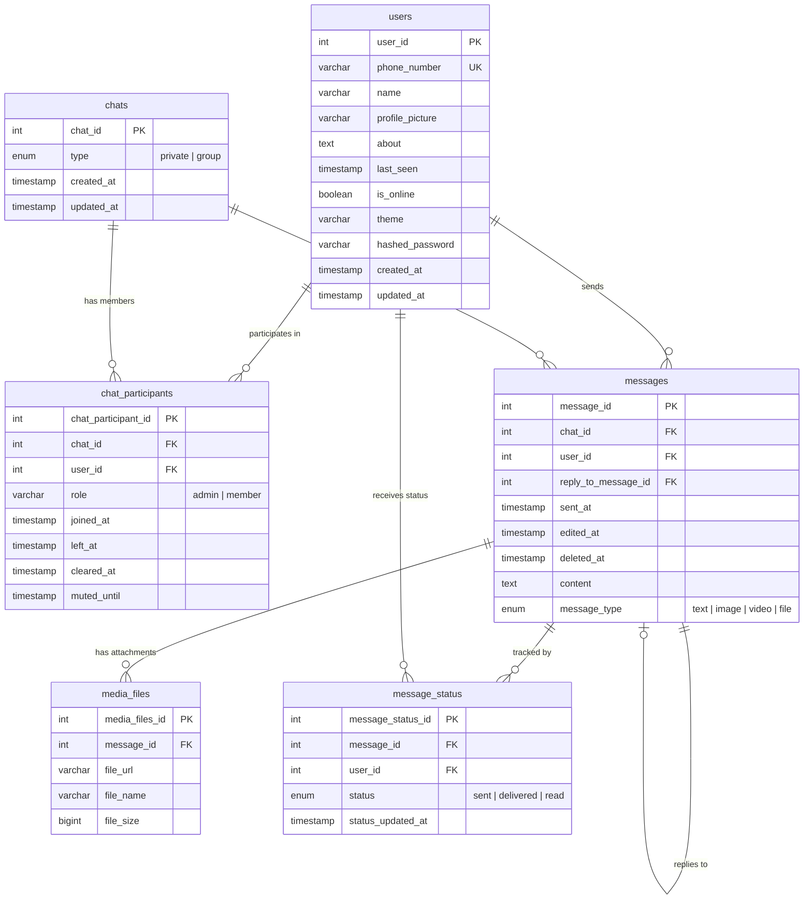

# 💬 WhatsApp Clone — Full-Stack Messaging Application

A production-grade, real-time messaging web application inspired by WhatsApp, featuring private & group chats, WebSocket-powered live messaging, JWT authentication, message delivery tracking, and a polished Material UI interface with dark/light theme support.

---

## 📋 Table of Contents

- [Features](#-features)
- [Tech Stack](#-tech-stack)
- [Architecture](#-architecture)
- [Project Structure](#-project-structure)
- [Database Schema](#-database-schema)
- [Getting Started](#-getting-started)
  - [Prerequisites](#prerequisites)
  - [Backend Setup](#1-backend-setup)
  - [Frontend Setup](#2-frontend-setup)
- [API Documentation](#-api-documentation)
  - [Authentication](#authentication)
  - [REST Endpoints](#rest-endpoints)
  - [WebSocket](#websocket)
- [Environment Variables](#-environment-variables)
- [Screenshots](#-screenshots)
- [License](#-license)

---

## ✨ Features

### Messaging
- **Real-time messaging** via WebSocket with automatic reconnection
- **Private chats** (1-on-1) and **group chats** with admin/member roles
- **Message reply threading** — reply to specific messages inline
- **Message editing & deletion** with soft-delete support
- **Message types** — text, image, video, and file messages
- **Media file attachments** linked to messages
- **Emoji picker** integration for rich text input

### Delivery & Status
- **Tri-state delivery tracking** — Sent ✓ → Delivered ✓✓ → Read ✓✓ (blue)
- **Real-time status updates** pushed via WebSocket to the sender
- **Automatic delivery marking** when a recipient connects online
- **Batch read receipts** when opening a chat

### User Experience
- **Online/offline presence** — real-time indicators with last-seen timestamps
- **Unread message counts** per chat on the sidebar
- **Notification sounds** for incoming messages (respects mute settings)
- **Chat muting** with configurable duration
- **Chat clearing** — per-user history clearing without affecting other participants
- **Search** — filter chats and contacts in the sidebar
- **Dark/Light theme** toggle — persisted per user in the database

### Authentication & Security
- **JWT-based authentication** with 7-day token expiry
- **Password hashing** using bcrypt
- **Protected routes** on the frontend with guest/authenticated guards
- **Bearer token** auto-attached to all API requests via Axios interceptor
- **CORS** configured for local development

---

## 🛠 Tech Stack

### Backend
| Technology | Purpose |
|---|---|
| **Python 3.11+** | Runtime |
| **FastAPI** | REST API framework with async support |
| **SQLAlchemy 2.0** | ORM with modern mapped column syntax |
| **PostgreSQL 14+** | Relational database |
| **Pydantic v2** | Request/response validation & serialization |
| **python-jose** | JWT token creation & verification |
| **bcrypt / passlib** | Password hashing |
| **Uvicorn** | ASGI server |
| **WebSocket (FastAPI)** | Real-time bidirectional communication |

### Frontend
| Technology | Purpose |
|---|---|
| **React 19** | UI library |
| **Vite 8** | Build tool & dev server |
| **Material UI (MUI) 9** | Component library & theming |
| **Zustand** | Lightweight global state management |
| **Axios** | HTTP client with interceptors |
| **React Router v7** | Client-side routing |
| **Day.js** | Date/time formatting |
| **emoji-picker-react** | Emoji selection for messages |

---

## 🏗 Architecture

```
┌──────────────────────────────────────────────────────────────────┐
│                        FRONTEND (React + Vite)                   │
│                                                                  │
│  ┌──────────┐  ┌───────────┐  ┌───────────┐  ┌──────────────┐  │
│  │  Pages   │  │Components │  │  Zustand   │  │  Axios API   │  │
│  │  Login   │  │  Sidebar  │  │   Store    │  │   Client     │  │
│  │ Register │  │ChatWindow │  │ (Global    │  │ (JWT auto-   │  │
│  │   Chat   │  │  Message  │  │  State)    │  │  attach)     │  │
│  │          │  │  Bubble   │  │            │  │              │  │
│  └──────────┘  └───────────┘  └───────────┘  └──────┬───────┘  │
│                                                      │          │
└──────────────────────────────────────────────────────┼──────────┘
                              REST API + WebSocket     │
┌──────────────────────────────────────────────────────┼──────────┐
│                     BACKEND (FastAPI)                 │          │
│                                                      ▼          │
│  ┌──────────────────────────────────────────────────────────┐   │
│  │                   API Layer (Routers)                     │   │
│  │   auth · users · chats · messages · media · ws            │   │
│  └───────────────────────────┬──────────────────────────────┘   │
│                              │                                   │
│  ┌───────────────────────────▼──────────────────────────────┐   │
│  │                  Service Layer (Business Logic)           │   │
│  │   UserService · ChatService · MessageService · etc.       │   │
│  └───────────────────────────┬──────────────────────────────┘   │
│                              │                                   │
│  ┌───────────────────────────▼──────────────────────────────┐   │
│  │                Repository Layer (Data Access)             │   │
│  │   Generic CRUD + domain-specific queries                  │   │
│  └───────────────────────────┬──────────────────────────────┘   │
│                              │                                   │
│  ┌───────────────────────────▼──────────────────────────────┐   │
│  │                    PostgreSQL Database                     │   │
│  └──────────────────────────────────────────────────────────┘   │
└──────────────────────────────────────────────────────────────────┘
```

### Key Design Principles

- **Clean Architecture** — strict separation of concerns across API → Service → Repository layers
- **Dependency Injection** — database sessions and services injected via FastAPI `Depends`
- **Repository Pattern** — isolated data access with no business logic leakage
- **Service Pattern** — validation, orchestration, and domain rules
- **Single Responsibility** — each module owns one bounded context

---

## 📁 Project Structure

```
Messaging Website/
├── backend/
│   ├── app/
│   │   ├── api/                    # FastAPI route handlers
│   │   │   ├── auth.py             #   Registration & login endpoints
│   │   │   ├── users.py            #   User CRUD operations
│   │   │   ├── chats.py            #   Chat CRUD + mute/clear actions
│   │   │   ├── messages.py         #   Message CRUD operations
│   │   │   ├── media_files.py      #   Media file management
│   │   │   ├── message_status.py   #   Delivery status tracking
│   │   │   ├── websocket.py        #   WebSocket connection manager
│   │   │   └── utils.py            #   Response builder utilities
│   │   ├── core/                   # Cross-cutting concerns
│   │   │   ├── config.py           #   Environment & settings
│   │   │   ├── constants.py        #   Enums (ChatType, MessageType, etc.)
│   │   │   ├── exceptions.py       #   Custom exception classes
│   │   │   ├── logger.py           #   Logging configuration
│   │   │   └── security.py         #   JWT & bcrypt utilities
│   │   ├── database/               # Database engine & session factory
│   │   ├── models/                 # SQLAlchemy ORM models
│   │   │   ├── user.py             #   User entity
│   │   │   ├── chat.py             #   Chat entity (private/group)
│   │   │   ├── chat_participant.py #   Many-to-many chat ↔ user
│   │   │   ├── message.py          #   Message entity with reply threading
│   │   │   ├── media_file.py       #   File attachments
│   │   │   └── message_status.py   #   Per-recipient delivery tracking
│   │   ├── repositories/           # Data access layer
│   │   ├── schemas/                # Pydantic request/response models
│   │   ├── services/               # Business logic layer
│   │   └── main.py                 # Application entry point & middleware
│   ├── migration.py                # Database table creation script
│   ├── requirements.txt            # Python dependencies
│   └── .env                        # Environment variables
│
├── frontend/
│   ├── public/                     # Static assets
│   ├── src/
│   │   ├── api/                    # API client layer
│   │   │   ├── axiosClient.js      #   Axios instance with JWT interceptor
│   │   │   ├── auth.js             #   Auth API calls
│   │   │   ├── users.js            #   User API calls
│   │   │   ├── chats.js            #   Chat API calls
│   │   │   ├── messages.js         #   Message API calls
│   │   │   ├── participants.js     #   Participant API calls
│   │   │   ├── messageStatus.js    #   Status API calls
│   │   │   └── mediaFiles.js       #   Media API calls
│   │   ├── components/             # Reusable UI components
│   │   │   ├── Sidebar.jsx         #   Chat list, search, user info
│   │   │   ├── ChatWindow.jsx      #   Active chat view & header
│   │   │   ├── MessageBubble.jsx   #   Individual message display
│   │   │   ├── MessageInput.jsx    #   Text input with emoji picker
│   │   │   ├── CreateChatDialog.jsx#   New chat creation modal
│   │   │   ├── ParticipantManager.jsx # Group member management
│   │   │   ├── SettingsDialog.jsx  #   Theme toggle settings
│   │   │   ├── SearchBar.jsx       #   Chat/contact search
│   │   │   ├── UserAvatar.jsx      #   Avatar with online indicator
│   │   │   └── UserList.jsx        #   User selection list
│   │   ├── pages/                  # Route-level page components
│   │   │   ├── LoginPage.jsx       #   Phone + password login
│   │   │   ├── RegisterPage.jsx    #   User registration form
│   │   │   └── ChatPage.jsx        #   Main chat interface
│   │   ├── store/
│   │   │   └── useAppStore.js      #   Zustand global store
│   │   ├── theme.js                #   MUI theme (dark/light)
│   │   ├── App.jsx                 #   Root component & routing
│   │   ├── App.css                 #   Global styles
│   │   ├── index.css               #   Base CSS reset
│   │   └── main.jsx                #   React DOM entry point
│   ├── index.html                  # HTML shell
│   ├── vite.config.js              # Vite configuration
│   ├── package.json                # Node.js dependencies
│   └── eslint.config.js            # Linting rules
│
└── message_app.drawio              # Database ERD diagram
```

---

## 🗄 Database Schema

The PostgreSQL database consists of 6 interconnected tables:



---

## 🚀 Getting Started

### Prerequisites

| Requirement | Version |
|---|---|
| **Python** | 3.11 or 3.12 (3.13+ may require updated pydantic wheels) |
| **Node.js** | 18+ |
| **PostgreSQL** | 14+ |
| **npm** | 9+ |

---

### 1. Backend Setup

```bash
# Clone the repository
git clone <repository-url>
cd "Messaging Website/backend"

# Create and activate virtual environment
python -m venv venv
source venv/bin/activate       # macOS/Linux
# venv\Scripts\activate        # Windows

# Install Python dependencies
pip install -r requirements.txt

# Create the PostgreSQL database
createdb whatsapp_db

# Configure environment variables
# Edit .env file with your PostgreSQL credentials (see Environment Variables section)

# Run database migrations (creates all tables)
python migration.py

# Start the backend server
uvicorn app.main:app --reload --host 0.0.0.0 --port 8000
```

The API will be available at `http://localhost:8000`.

---

### 2. Frontend Setup

```bash
# Open a new terminal
cd "Messaging Website/frontend"

# Install Node.js dependencies
npm install

# Start the development server
npm run dev
```

The app will be available at `http://localhost:5173`.

---

## 📖 API Documentation

Once the backend is running, interactive API docs are available at:

| Interface | URL |
|---|---|
| **Swagger UI** | [http://localhost:8000/docs](http://localhost:8000/docs) |
| **ReDoc** | [http://localhost:8000/redoc](http://localhost:8000/redoc) |
| **Health Check** | [http://localhost:8000/health](http://localhost:8000/health) |

### Authentication

The app uses **JWT Bearer Token** authentication.

```bash
# Register a new user
curl -X POST http://localhost:8000/auth/register \
  -H "Content-Type: application/json" \
  -d '{"phone_number": "+1234567890", "name": "Alice", "password": "securepass123"}'

# Login to receive a JWT token
curl -X POST http://localhost:8000/auth/login \
  -H "Content-Type: application/json" \
  -d '{"phone_number": "+1234567890", "password": "securepass123"}'
# Response: { "access_token": "eyJ...", "token_type": "bearer", "user": {...} }

# Use the token in subsequent requests
curl -H "Authorization: Bearer <access_token>" http://localhost:8000/users
```

### REST Endpoints

| Resource | Base Path | Methods |
|---|---|---|
| **Auth** | `/auth` | `POST /register`, `POST /login` |
| **Users** | `/users` | `POST`, `GET`, `GET /{id}`, `PUT /{id}`, `DELETE /{id}` |
| **Chats** | `/chats` | `POST`, `GET`, `GET /{id}`, `PUT /{id}`, `DELETE /{id}`, `POST /{id}/mute`, `POST /{id}/clear` |
| **Chat Participants** | `/chats/participants` | `POST`, `GET`, `GET /{id}`, `PUT /{id}`, `DELETE /{id}` |
| **Messages** | `/messages` | `POST`, `GET`, `GET /{id}`, `PUT /{id}`, `DELETE /{id}` |
| **Media Files** | `/media-files` | `POST`, `GET`, `GET /{id}`, `PUT /{id}`, `DELETE /{id}` |
| **Message Status** | `/message-status` | `POST`, `GET`, `GET /{id}`, `PUT /{id}`, `DELETE /{id}` |

All responses follow a standardized wrapper format:
```json
{
  "status_code": 200,
  "message": "Success",
  "data": { ... },
  "timestamp": "2026-07-08T12:00:00Z"
}
```

### WebSocket

Real-time features are powered by a WebSocket connection:

```
ws://localhost:8000/ws?token=<JWT_TOKEN>
```

**Events received by the client:**

| Event | Payload | Description |
|---|---|---|
| `new_message` | `{ message_id, chat_id, user_id, content, ... }` | A new message was sent in a chat the user belongs to |
| `status_update` | `{ message_id, user_id, status }` | A message's delivery status changed (delivered/read) |
| `user_online` | `{ user_id, is_online, last_seen }` | A user came online or went offline |

**Connection lifecycle:**
1. Client connects with JWT token as query parameter
2. Server validates token and accepts connection
3. User is marked as **online** in the database
4. Pending `sent` statuses are upgraded to `delivered`
5. All connected users are notified of the presence change
6. On disconnect, user is marked **offline** with `last_seen` timestamp

---

## ⚙ Environment Variables

Create a `.env` file in the `backend/` directory:

```env
# Application
APP_NAME=WhatsApp Clone API
APP_VERSION=1.0.0
DEBUG=false

# Database
DATABASE_URL=postgresql://<user>:<password>@localhost:5432/whatsapp_db

# Security (change in production!)
SECRET_KEY=a_very_secure_secret_key_change_me_in_production
```

| Variable | Description | Default |
|---|---|---|
| `APP_NAME` | Application display name | — |
| `APP_VERSION` | Semantic version string | — |
| `DEBUG` | Enable debug mode | `false` |
| `DATABASE_URL` | PostgreSQL connection URI | — |
| `SECRET_KEY` | JWT signing secret | `a_very_secure_...` |

---

## 🖼 Screenshots

> _Screenshots coming soon — run the app locally to explore the full UI!_

---

## 📜 License

This project is licensed under the **MIT License**.
